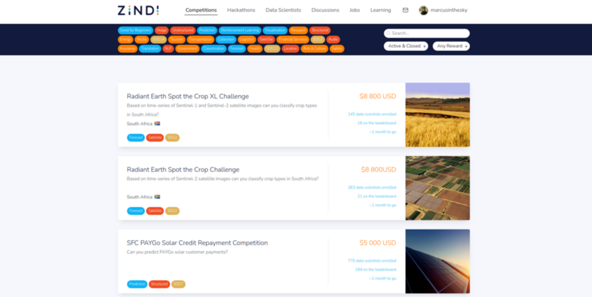

<!---
What i want them to know is there is a lot of resources online and there are practice places like kaggle and zindi which they must use to showcase their skills

--->
# How to Grow 🌲 and Show-off 🥇 as a Data Scientist 👨‍🔬️  

---

.qr: https://github.com/marcusinthesky/Talk

---

---

---
# Checklist 🏁

### Resources 📑
Hello `World`

### Projects 👨‍💻️
    !python
    import numpy as np

    def multiply (x, y):
        return x * y

### Communities 📺

---

#  Listen

---

# Code

---

# Watch
<iframe width="560" height="315" src="https://www.youtube.com/embed/qcrR-Hd0LhI?start=677" title="YouTube video player" frameborder="0" allow="accelerometer; autoplay; clipboard-write; encrypted-media; gyroscope; picture-in-picture" allowfullscreen></iframe>
&nbsp; 
<iframe width="560" height="315" src="https://www.youtube.com/embed/rR5_emVeyBk" title="YouTube video player" frameborder="0" allow="accelerometer; autoplay; clipboard-write; encrypted-media; gyroscope; picture-in-picture" allowfullscreen></iframe>

---

# Read

&nbsp; 
&nbsp; 

---

# Compete

---

# Write
